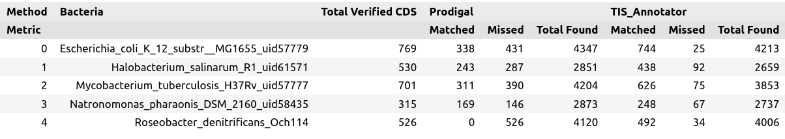
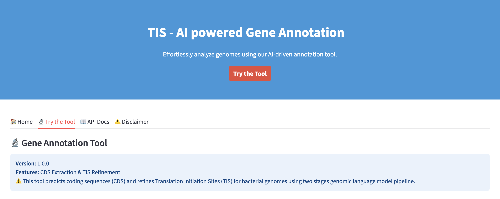
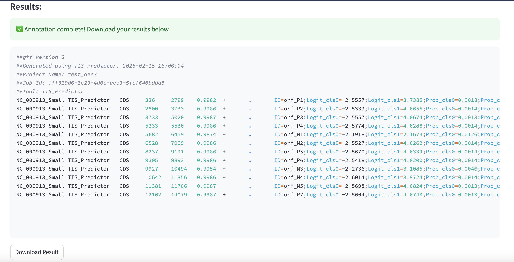

## TIS Annotator

Translation Initiation Site Predictor in Bacteria
: This tool predicts coding sequences (CDS) and refines Translation Initiation Sites (TIS) for bacterial genomes using two stages genomic language model pipeline.
The code for model training can be found at [LLM_GeneAnnotator](https://github.com/Genereux-akotenou/LLM_GeneAnnotator).

To load our TIS Annotator model, you can use transformers library: 

```python
import torch
from transformers import AutoModelForSequenceClassification, AutoTokenizer

# Load Model
model_checkpoint = "Genereux-akotenou/BacteriaCDS-DNABERT-K6-89M"
model = AutoModelForSequenceClassification.from_pretrained(model_checkpoint)
tokenizer = AutoTokenizer.from_pretrained(model_checkpoint)
```
**Inference Example**: This model works with 6-mer tokenized sequences. You need to convert raw DNA sequences into k-mer format:

```python
def generate_kmer(sequence: str, k: int, overlap: int = 1):
    return " ".join([sequence[j:j+k] for j in range(0, len(sequence) - k + 1, overlap)])

sequence = "ATGAGAACCAGCCGGAGACCTCCTGCTCGTACATGAAAGGCTCGAGCAGCCGGGCGAGGGCGGTAG" 
seq_kmer = generate_kmer(sequence, k=6, overlap=3)

# Run inference
inputs = tokenizer(
  seq_kmer,
  return_tensors="pt",
  max_length=tokenizer.model_max_length,
  padding="max_length",
  truncation=True
)
with torch.no_grad():
  outputs = model(**inputs)
  logits = outputs.logits
  predicted_class = torch.argmax(logits, dim=-1).item()
```

This will give first stage classifition ouput you can refine using the second stage classifier. See instructions here: [Loading model for second stage](https://huggingface.co/Genereux-akotenou/BacteriaTIS-DNABERT-K6-89M)

## Benchmarck Table


<!-- | Method  | Bacteria                                      | Total Verified CDS | Prodigal Matched | Prodigal Missed | Prodigal Total Found | TIS_Annotator Matched | TIS_Annotator Missed | TIS_Annotator Total Found |
|---------|----------------------------------------------|--------------------|------------------|----------------|------------------|------------------|----------------|------------------|
|         | **Escherichia coli K-12 MG1655**             | 769                | 338              | 431            | 4347             | 744              | 25             | 4213             |
|         | **Halobacterium salinarum R1**               | 530                | 243              | 287            | 2851             | 438              | 92             | 2659             |
|         | **Mycobacterium tuberculosis H37Rv**         | 701                | 311              | 390            | 4204             | 626              | 75             | 3853             |
|         | **Natronomonas pharaonis DSM 2160**          | 315                | 169              | 146            | 2873             | 248              | 67             | 2737             |
|         | **Roseobacter denitrificans Och114**         | 526                | 0                | 526            | 4120             | 492              | 34             | 4006             | -->

## Web tools guidelines


#### 1. Create environment
Firstly, we will create a python environment called
```sh
python -m venv venv
```
Secondly, we will login to the environement
```sh
source ./venv/bin/activate
```
#### 2. Install prerequisite libraries

```sh
pip install -r requirements.txt
```

####  3. Launch the web tool ui
```
streamlit run ui/app.py
```

####  4. Launch the api
```
uvicorn --app-dir api api:app --host 127.0.0.1 --port 8000 --reload
```

#### 5. Start annotation

Go on the web tool page and submit a fasta/fna file containing your full genome sequence:


The results should look like this: 




<!-- 

uvicorn --app-dir api api:app --host 10.52.88.33 --port 8000 --reload 
python start.py 

-->
