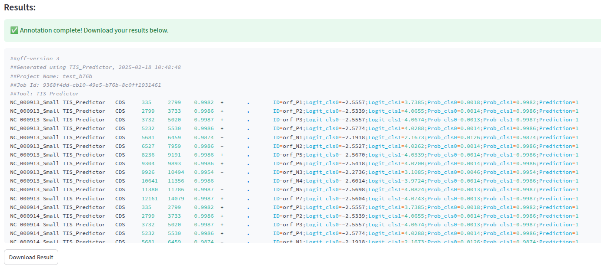

#### Create environment
Firstly, we will create a python environment called
```sh
python -m venv venv
```
Secondly, we will login to the environement
```sh
source ./venv/bin/activate
```
#### Install prerequisite libraries

```sh
pip install -r requirements.txt
```

####  Launch the web tool ui
```
streamlit run ui/app.py
```

####  Launch the api
```
uvicorn --app-dir api api:app --host 172.0.0.1 --port 8000 --reload
```

#### Launch annotation:

Go on the web tool page and submit a fasta/fna file containing your full genome sequence:


The results should look like this: 




<!-- 

uvicorn --app-dir api api:app --host 10.52.88.33 --port 8000 --reload 
python start.py 

-->
